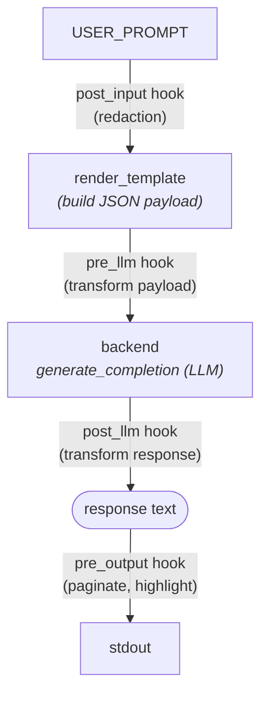

# Architecture

ell is a small, dependency-light bash program: an entrypoint (`ell.sh`), a set
of sourced helpers under `helpers/`, pluggable LLM backends under
`llm_backends/`, and user plugins discovered across several search roots. This
document explains how the pieces fit together.

## Entry points

- **`ell`** — a thin launcher. It resolves its own directory (following
  symlinks) and execs `ell.sh`, so the bundled helpers/templates are found no
  matter how ell was invoked (in place, on `PATH`, or via a symlink in
  `~/.local/bin`).
- **`ell.sh`** — the orchestrator. It checks the bash version, sources the
  helpers and the selected backend, loads configuration, parses arguments,
  builds a request from a template, runs it through the backend, and applies
  plugin hooks around each stage.

## Startup sequence (`ell.sh`)

1. **bash version gate** — require bash >= 4.1.
2. **Resolve `BASE_DIR`** to an absolute path (needed because record mode
   re-execs ell from a different working directory).
3. **Source helpers** (`helpers/*.sh`) and then the backend dispatcher.
4. **`load_config`** — layer configuration (see below).
5. **Apply defaults** for any `ELL_*` still unset.
6. **`parse_arguments`** — command-line flags override everything.
7. **Preflight** — for a network backend, require `ELL_API_URL` (fatal if
   missing) and warn if `ELL_API_KEY` is unset.
8. **Decide output** — redirect stdout to `ELL_OUTPUT_FILE` (plain mode only),
   detect TTY, read terminal size.
9. **Decorate `generate_completion`** with the pre/post-LLM hooks.
10. **Record mode** (optional) — re-exec ell under `script` to capture the
    session (see below).
11. **Resolve the template**, optionally read the prompt from a file.
12. **Build and send the request**, once (one-shot) or in a loop (interactive).

## Configuration precedence

`load_config` layers configuration so that later sources win, while never
overriding a variable already set in the environment:

1. built-in defaults (in `ell.sh`)
2. config files, in order: XDG config, `~/.ellrc`, `$PWD/.ellrc`, `$ELL_CONFIG`
3. environment variables
4. command-line arguments (highest priority)

Config files are *sourced* (executed), so `load_config` only sources a file
owned by the current user (or root) and not group-/world-writable. See
[Configuration](Configuration.md) and [Risk Consideration](Risk_Consideration.md).

## The request pipeline and hook stages

A prompt flows through four hook stages. Each stage runs every plugin hook of
that kind (discovered across the search roots) as a pipeline via `piping`:

- **`post_input`** — transforms `USER_PROMPT` (and the recorded
  `SHELL_CONTEXT`) *before* it is substituted into the template. This is where
  redaction runs, so secrets are scrubbed before anything is sent.
- **`render_template`** — substitutes the allowlisted `${VAR}` placeholders into
  the JSON template, JSON-escaping string values. Templates are treated as data
  and never shell-evaluated. See [Templates](Templates.md).
- **`pre_llm`** — transforms the request payload before it reaches the backend.
- **backend** — `generate_completion` sends the payload and prints the
  completion text. See [Backends](Backends.md).
- **`post_llm`** — transforms the backend's response.
- **`pre_output`** — transforms the final text before it is written to stdout
  (pagination, syntax highlighting).

The decoration in `ell.sh` renames the backend's `generate_completion` to
`orig_generate_completion` and wraps it so that `pre_llm | orig_generate_completion
| post_llm` runs as one pipeline, with the backend's exit status (not the last
hook's) propagated.

Hooks are shell scripts named `<NN>_<stage>.sh` (e.g. `50_post_input.sh`) under
`plugins/<name>/` in any search root; a hook whose filename contains `.disabled`
is skipped. See [Plugins](Plugins.md).

## Backends

`ELL_API_STYLE` selects `llm_backends/<style>/generate_completion.sh`, which is
sourced and must define `generate_completion` (stdin = request body, stdout =
completion text, exit code = status). `helpers/backend_common.sh` holds the
non-streaming path, end-of-stream reporting, and PIPESTATUS handling shared by
the bundled backends; each backend keeps only its provider-specific streaming
parser. See [Backends](Backends.md).

## Record mode

When recording (or interactive) is requested, ell re-execs itself under
`script(1)` so the whole session is captured to a log, and the tail of that log
is fed back as `SHELL_CONTEXT` on subsequent turns. The re-exec uses an
absolute, shell-quoted path to the `ell` launcher so it does not depend on ell
being on `PATH`.

## Helpers (`helpers/`)

| File | Responsibility |
|------|----------------|
| `logging.sh` | Leveled logging to stderr (`logging_debug`…`logging_fatal`). |
| `parse_arguments.sh` | CLI flag parsing and usage/version output. |
| `load_config.sh` | Layered, trust-checked configuration loading. |
| `piping.sh` | Run a list of hook scripts as a pipeline. |
| `json.sh` | Pure-bash JSON parser (`json_parse`/`json_get`/`json_has`), no `jq`. |
| `resolve_paths.sh` | Discover templates and plugin hooks across search roots. |
| `render_template.sh` | Safe allowlist template rendering + JSON escaping. |
| `http.sh` | `ell_curl` wrapper: timeouts, HTTP errors, off-argv credentials. |
| `backend_common.sh` | Shared non-streaming / reporting / PIPESTATUS logic. |
| `render_to_text.awk` | Render recorded terminal output to plain text. |

## Testing

Unit tests live next to their source as `<name>.test.sh` and are
auto-discovered; end-to-end tests that drive the whole `ell` pipeline live in
`tests/`. `tests/entry.sh` runs everything; `tests/docker.sh` runs it across
bash versions. See the README's testing section (and CONTRIBUTING.md).
